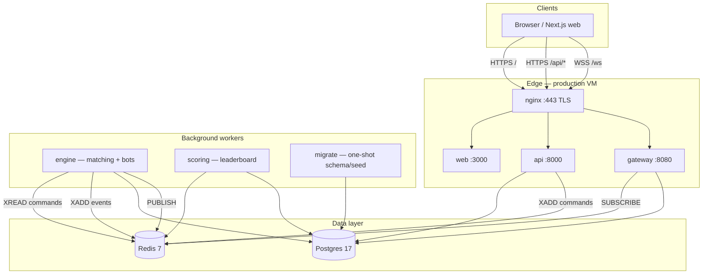
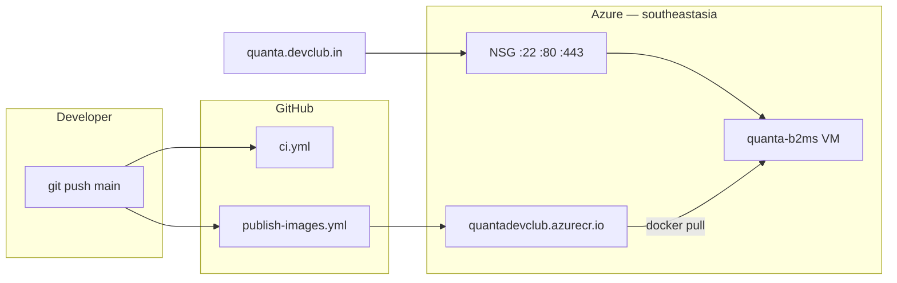

# AGENTS.md — Quanta Quant Trading Platform

Guide for AI coding agents working in this repository. Read this before making changes.

## Project summary

**Quanta** is a competitive quant trading challenge platform: market-making contests, directional PnL races, and admin-configurable formats. Participants trade synthetic instruments in real time; organizers run events via an admin UI.

- **Production URL:** https://quanta.devclub.in
- **GitHub:** https://github.com/itxprashant/quant-trading-platform
- **Stack:** TypeScript monorepo (pnpm + turbo), Next.js 15, Fastify, Postgres 17, Redis 7, Docker
- **Design bar:** Dark trading-terminal aesthetic — see `PRODUCT.md` and `DESIGN.md`. Data-first, dense, no generic SaaS or neon crypto clichés.

---

## Complete system architecture

### 1. High-level overview

Quanta is an event-driven trading platform: the **API** accepts authenticated REST requests, the **matching engine** owns order books and emits events, the **gateway** fans out real-time updates over WebSockets, and the **scoring worker** computes leaderboards. **Postgres** is the system of record; **Redis** is the command bus, event log, hot cache, pub/sub layer, and coordination plane.



### 2. Production deployment topology

Current production is a **single Azure VM** running the full stack in Docker Compose. Images are built in **GitHub Actions** and pulled from **Azure Container Registry (ACR)** — do not compile on the VM for routine releases.



| Layer | Components |
|-------|------------|
| **DNS / TLS** | `quanta.devclub.in` → `20.205.227.58`; Let's Encrypt via certbot |
| **Reverse proxy** | nginx — `/` → web, `/api/` → api, `/ws` → gateway |
| **App containers** | migrate, api, gateway, engine, scoring, web |
| **Data containers** | postgres (volume `qtp-pgdata`), redis (volume `qtp-redisdata`) |
| **Registry** | `quantadevclub.azurecr.io/quanta-{service}:sha-<commit>` |
| **Future scale-out** | `infra/terraform/` — AWS ECS + Aurora + ElastiCache skeleton |

Docker network: all services on internal bridge `internal`; only nginx exposes 80/443.

### 3. Runtime services

| Service | Port | Role | Stateful? |
|---------|------|------|-----------|
| **web** | 3000 | Next.js 15 App Router — trader dashboard, challenge pages, admin builder | No |
| **api** | 8000 | Fastify REST — auth, challenges, orders, market, portfolio, leaderboard, admin | No |
| **gateway** | 8080 | WebSocket server — subscribe to challenges, fan-out ticks/fills/book | No (in-memory conn registry) |
| **engine** | — | Per-challenge matching runners, lifecycle transitions, autonomous bots | Yes (in-memory books per challenge) |
| **scoring** | — | Periodic leaderboard recompute from positions + engine metrics | No |
| **migrate** | — | One-shot: `db:push` + `db:seed` on compose up | No |
| **nginx** | 80/443 | TLS termination, reverse proxy | No |
| **postgres** | 5432 | Durable relational state | Yes |
| **redis** | 6379 | Streams, pub/sub, hot cache, locks, rate limits | Yes (AOF enabled in prod) |

### 4. Order flow (write path)

How a limit order travels from click to fill notification:

```
1. Trader POST /api/orders  (JWT in Authorization header)
2. API validates input (Zod), checks challenge is live, rate-limits user
3. API inserts order row (status=open) in Postgres
4. API XADD EngineCommand → Redis stream qtp:cmd:{challengeId}
5. Engine ChallengeRunner reads command stream (consumer group)
6. Engine matches against in-memory order book (packages/core)
7. Engine updates cash/positions/orders in Postgres (persistence layer)
8. Engine XADD EngineEvent → Redis stream qtp:evt:{challengeId}
9. Engine updates hot Redis state (price, book snapshot, trader metrics)
10. Engine PUBLISH → Redis channel qtp:bc:{challengeId}
11. Gateway receives pub/sub message, fans out to subscribed WS clients
12. Scoring worker (async loop) reads metrics/prices, recomputes leaderboard
13. Scoring SET qtp:lb:{challengeId} + PUBLISH leaderboard update
```

**Invariant:** Only the engine process holding `qtp:lock:engine:{challengeId}` mutates the order book for that challenge.

### 5. Real-time flow (read path)

```
1. Client opens WSS /ws?token=<JWT>
2. Gateway verifies JWT, registers connection
3. Client sends { type: "subscribe", challengeId }
4. Gateway adds conn to challenge registry, sends snapshot (price + book from Redis)
5. Gateway Fanout subscribes to qtp:bc:{challengeId} on Redis pub/sub
6. On each engine broadcast envelope → JSON message to subscribed clients
7. Slow clients (bufferedAmount > limit) are terminated (backpressure)
```

WebSocket message types are defined in `packages/shared/src/ws.ts` (`ClientMessage`, `ServerMessage`).

### 6. Challenge lifecycle

Managed by the engine's reconcile loop (`apps/engine/src/index.ts`):

```
draft → scheduled → live → paused → ended
         ↑ auto-start      ↑ admin    ↑ auto-end or admin
         (startsAt)                   (endsAt)
```

| Status | Trading | Engine runner | Redis `qtp:active-challenges` |
|--------|---------|---------------|-------------------------------|
| draft | No | No | No |
| scheduled | No | No (until startsAt) | No |
| live | Yes | Yes (if lock acquired) | Yes |
| paused | No | Runner stopped | No |
| ended | No | Runner stopped | No |

Each challenge has isolated: command stream, event stream, broadcast channel, order books, bots, and leaderboard.

### 7. Redis data model

Central naming in `packages/shared/src/keys.ts`:

| Key / pattern | Type | Writer | Reader | Purpose |
|---------------|------|--------|--------|---------|
| `qtp:cmd:{challengeId}` | Stream | API | Engine | Order/cancel/admin commands |
| `qtp:evt:{challengeId}` | Stream | Engine | Scoring (future replay) | Durable event log |
| `qtp:bc:{challengeId}` | Pub/sub | Engine | Gateway | Real-time fan-out |
| `qtp:price:{cid}:{symbol}` | String | Engine | Gateway, API, Scoring | Last trade/mid price |
| `qtp:phist:{cid}:{symbol}` | Sorted set | Engine | API (charts) | Price history (max 1000) |
| `qtp:book:{cid}:{symbol}` | String (JSON) | Engine | Gateway | Order book snapshot |
| `qtp:lock:engine:{cid}` | String + TTL | Engine | Engine | Leader election |
| `qtp:active-challenges` | Set | Engine | Engine, Scoring | Pool membership |
| `qtp:lb:{cid}` | String (JSON) | Scoring | API, Gateway | Leaderboard snapshot |
| `qtp:metrics:{cid}` | Hash | Engine | Scoring | Per-trader MM metrics JSON |
| `qtp:rl:{bucket}:{userId}` | String | API | API | Token-bucket rate limit |

### 8. Postgres data model

Schema in `packages/db/src/schema.ts` (Drizzle ORM):

| Table | Purpose |
|-------|---------|
| `users` | Accounts — username, password hash, role (`trader` \| `admin`) |
| `challenges` | Event config — type, status, symbols, limits, scoring, schedule |
| `challenge_participants` | Enrollment — cash balance per user per challenge |
| `orders` | Order intent + status (open → filled/cancelled) |
| `fills` | Executed trades |
| `positions` | Per-symbol inventory per participant |
| `score_snapshots` | Historical leaderboard rows |

Challenge `config` (JSONB) includes: symbols, starting cash, max order quantity, bot settings.  
Challenge `scoring` (JSONB) selects directional PnL vs market-making weights.

### 9. Matching engine internals

| Layer | Location | Responsibility |
|-------|----------|----------------|
| **Pure matching** | `packages/core/src/engine.ts`, `order-book.ts` | Price-time priority book, match loop |
| **Scoring math** | `packages/core/src/scoring.ts` | Directional PnL + MM composite score |
| **Runner** | `apps/engine/src/runner.ts` | Command loop, persistence, event emission |
| **Bots** | `apps/engine/src/bots.ts` | Market-maker quotes + noise traders |
| **Persistence** | `apps/engine/src/persistence.ts` | Postgres writes for fills, positions, cash |

Engine tick interval: `ENGINE_TICK_MS` (1000 ms prod, 250 ms local dev).

### 10. Scoring system

`apps/scoring` polls active challenges on an interval:

1. Load participants, positions, challenge scoring config from Postgres
2. Read current prices from Redis
3. Read per-trader metrics hash from Redis (spread capture, quote uptime, volume, realized PnL — tracked by engine)
4. `computeScore()` from `@qtp/core` → ranked entries
5. Write `qtp:lb:{challengeId}` and broadcast leaderboard WS message
6. Periodically persist `score_snapshots` to Postgres

Challenge types: **`directional`** (PnL-focused) and **`market_making`** (MM metrics weighted).

### 11. API surface

Fastify app in `apps/api/src/app.ts`. Routes under `apps/api/src/routes/`:

| Prefix | Auth | Purpose |
|--------|------|---------|
| `/api/auth` | Public | Login → JWT |
| `/api/challenges` | Mixed | List, detail, enroll |
| `/api/orders` | Trader | Place, cancel, list open |
| `/api/market` | Trader | Prices, book, history |
| `/api/portfolio` | Trader | Cash, positions, MM metrics |
| `/api/leaderboard` | Public/trader | Rankings |
| `/api/admin` | Admin | CRUD challenges, lifecycle control |
| `/api/health` | Public | Health check |
| `/api/metrics` | Public | Prometheus metrics |

Rate limiting: Redis token bucket via `apps/api/src/ratelimit.ts` (orders bucket: 25/s per user).

### 12. Authentication & authorization

```
Login → API signs JWT (JWT_SECRET, default 86400s TTL)
      → Web stores token (localStorage)
      → REST: Authorization: Bearer <token>
      → WS: ?token=<token> query param on /ws
Roles: trader (trade + view), admin (+ challenge management)
```

`JWT_SECRET` must be identical on **api** and **gateway**. CORS enforced on API via `CORS_ORIGINS`.

### 13. Frontend architecture

Next.js App Router (`apps/web/src/app/`):

| Route | Audience | Purpose |
|-------|----------|---------|
| `/` | All | Challenge list |
| `/login` | All | Authentication |
| `/challenges/[id]` | Trader | Trading terminal (chart, book, ticket, portfolio, leaderboard) |
| `/admin` | Admin | Challenge management |
| `/admin/new`, `/admin/[id]` | Admin | Challenge builder |

Real-time: `hooks/useRealtime.ts` manages WS connection, subscriptions, message dispatch.  
API client: `lib/api.ts`. Config: `lib/config.ts` reads `NEXT_PUBLIC_*` (build-time).

### 14. CI/CD pipeline architecture

```
Push to main
  ├── ci.yml          → pnpm install → build → typecheck → test → db:push → db:seed
  └── publish-images  → matrix build (6 services) → push to ACR
                          ├── migrate   (Dockerfile.migrate)
                          ├── api       (Dockerfile.service SERVICE=api)
                          ├── gateway   (Dockerfile.service SERVICE=gateway)
                          ├── engine    (Dockerfile.service SERVICE=engine)
                          ├── scoring   (Dockerfile.service SERVICE=scoring)
                          └── web       (Dockerfile.web + NEXT_PUBLIC_*)
```

**Deploy:** `registry-vm-deploy.sh` rsyncs compose/nginx → VM → `docker compose pull` → `up -d`.  
See [Deployment — use the CI registry route](#deployment--use-the-ci-registry-route).

### 15. Monorepo dependency graph

```
apps/web        → @qtp/shared, @qtp/config
apps/api        → @qtp/shared, @qtp/core, @qtp/bus, @qtp/db
apps/gateway    → @qtp/shared, @qtp/bus, @qtp/db
apps/engine     → @qtp/shared, @qtp/core, @qtp/bus, @qtp/db
apps/scoring    → @qtp/shared, @qtp/core, @qtp/bus, @qtp/db
packages/bus    → @qtp/shared
packages/db     → @qtp/shared
packages/core   → @qtp/shared
```

Build orchestration: **turbo** (`turbo.json`) + **pnpm workspaces** (`pnpm-workspace.yaml`).

### 16. Architecture invariants (do not break)

1. **Single engine writer per challenge** — Redis lock + one `ChallengeRunner` per live challenge.
2. **Commands via Redis stream, not direct engine calls** — API never invokes engine in-process.
3. **Gateway is read-only for trading state** — no order placement over WS.
4. **Postgres is source of truth** for orders, fills, positions, users; Redis is ephemeral hot state.
5. **Per-challenge isolation** — streams, channels, books, bots, leaderboards are keyed by `challengeId`.
6. **Web public URLs are build-time** — changing API/WS URLs requires rebuilding the web image in CI.
7. **Production deploys use CI registry** — pull pre-built images; on-VM compile is fallback only.

---

## Repository layout

```
apps/
  web/        Next.js 15 frontend (trader dashboard + admin)
  api/        Fastify REST (auth, challenges, orders, market, leaderboard, admin)
  engine/     Matching engine + bots (per-challenge runners)
  gateway/    WebSocket gateway (Redis fan-out)
  scoring/    Leaderboard / scoring worker

packages/
  shared/     Domain types, Zod schemas, WS protocol, Redis key helpers
  core/       Pure matching engine + scoring logic (unit tested with Vitest)
  bus/        Redis streams, pub/sub, hot state helpers
  db/         Drizzle ORM schema, client, migrations, seed
  config/     Shared tsconfig presets (@qtp/config)

infra/
  docker/     Dockerfile.service (api|gateway|engine|scoring), Dockerfile.web, Dockerfile.migrate
  nginx/      Reverse proxy + TLS (Let's Encrypt via certbot)
  azure/      cloud-init, CI-REGISTRY.md
  terraform/  AWS ECS/Aurora skeleton (future scale-out; prod demo uses single Azure VM)

scripts/      Deploy, HTTPS, registry, changed-service detection, load test

.github/workflows/
  ci.yml              Build, typecheck, test, db push/seed on PR/push
  publish-images.yml  Build + push all images to ACR on push to main
```

Package names use the `@qtp/*` scope (e.g. `@qtp/api`, `@qtp/shared`).

## Local development

**Prerequisites:** Node 20+, pnpm 11.8 (via `packageManager` in root `package.json`), Docker.

```bash
pnpm install
cp .env.example .env
pnpm infra:up          # Postgres + Redis (docker-compose.yml)
pnpm db:push
pnpm db:seed
pnpm dev               # all apps via turbo
```

Open http://localhost:3000.

**Seeded logins:** `admin / admin1234`, `trader1..8 / trader1234`

| Command | Purpose |
|---------|---------|
| `pnpm build` | Build entire monorepo |
| `pnpm typecheck` | Type-check all packages |
| `pnpm test` | Unit tests (core engine, etc.) |
| `pnpm db:push` / `db:seed` | Schema + seed data |
| `pnpm infra:up` / `infra:down` | Local Postgres + Redis |

On some Linux kernels, `docker-compose.override.yml` uses host networking for Postgres to avoid connection resets.

## Production infrastructure (Azure single VM)

| Item | Value |
|------|-------|
| Resource group | `quanta-rg` |
| VM | `quanta-b2ms` (`Standard_D2s_v3`, 8 GB) |
| Region | `southeastasia` |
| Public IP | `20.205.227.58` |
| Domain | `quanta.devclub.in` (HTTPS via Let's Encrypt) |
| SSH | `ssh -i ~/.ssh/quanta_azure azureuser@20.205.227.58` |
| ACR | `quantadevclub.azurecr.io` |

Stack on VM: `docker compose -f docker-compose.prod.yml` — postgres, redis, migrate, api, gateway, engine, scoring, web, nginx.

Secrets live in `.env.prod` (gitignored, local only). Never commit `.env.prod`, `.acr-github-secrets.env`, or JWT/database passwords.

---

## Deployment — use the CI registry route

**Default for all production deploys:** build images in GitHub Actions, pull on the VM. Do **not** compile on the VM unless registry deploy is impossible (e.g. CI down, emergency hotfix).

### Standard release flow (~5–7 min total)

1. **Merge/push to `main`** — triggers CI + **Publish Docker Images** workflow (~2–3 min).
2. **Wait for Actions** — confirm `.github/workflows/publish-images.yml` succeeded.
3. **Deploy from registry:**

```bash
REGISTRY=quantadevclub.azurecr.io \
IMAGE_TAG=sha-$(git rev-parse --short HEAD) \
./scripts/registry-vm-deploy.sh
```

Or: `pnpm deploy:registry` (with `REGISTRY` and `IMAGE_TAG` exported).

Images published per service:

```
quantadevclub.azurecr.io/quanta-migrate:sha-<commit>
quantadevclub.azurecr.io/quanta-api:sha-<commit>
quantadevclub.azurecr.io/quanta-gateway:sha-<commit>
quantadevclub.azurecr.io/quanta-engine:sha-<commit>
quantadevclub.azurecr.io/quanta-scoring:sha-<commit>
quantadevclub.azurecr.io/quanta-web:sha-<commit>
```

Uses `docker-compose.prod.yml` + `docker-compose.registry.yml` (pull only, no `--build`).

### When CI / registry applies

| Change type | Action |
|-------------|--------|
| App code (api, engine, web, …) | Push to `main` → wait for publish → `registry-vm-deploy.sh` |
| `NEXT_PUBLIC_*` URL change | Update GitHub Actions **variables**, re-run publish (web image rebuild), then registry deploy |
| nginx / compose / `.env.prod` only | `registry-vm-deploy.sh` (no CI rebuild needed) |
| Schema (`packages/db`) | CI rebuild includes `migrate` image; registry deploy runs migrate on `up -d` |

### Fallback: on-VM build (slower, avoid for routine deploys)

Only when CI is unavailable or you need an uncommitted local patch:

```bash
./scripts/deploy-changed.sh              # rebuild only changed services (~3–8 min)
BUILD_ALL=1 SKIP_PROVISION=1 ./scripts/azure-deploy.sh   # full on-VM rebuild (~15–20 min)
```

See `scripts/changed-services.sh` and `scripts/lib/service-graph.sh` for dependency-aware service selection.

### First-time / infra setup

| Script | Purpose |
|--------|---------|
| `./scripts/azure-deploy.sh` | Provision VM + initial deploy |
| `./scripts/setup-ci-registry.sh` | Create ACR, VM docker login |
| `./scripts/setup-github-secrets.sh` | Push ACR creds to GitHub Actions |
| `./scripts/setup-https.sh --remote` | Certbot + TLS for `quanta.devclub.in` |

Full registry docs: `infra/azure/CI-REGISTRY.md`

### Deploy timing reference

| Method | Typical duration |
|--------|------------------|
| **CI publish + registry deploy** (recommended) | **~5–7 min** |
| `deploy-changed.sh` (one backend) | ~3–6 min |
| `deploy-changed.sh` (web only) | ~5–8 min |
| Full on-VM rebuild | ~15–20 min |

---

## CI/CD

| Workflow | Trigger | Purpose |
|----------|---------|---------|
| `ci.yml` | Push/PR to `main` | install → build → typecheck → test → db:push → db:seed |
| `publish-images.yml` | Push to `main` | Parallel Docker build → push to ACR |

GitHub Actions variables (repo settings):

- `ACR_LOGIN_SERVER` = `quantadevclub.azurecr.io`
- `NEXT_PUBLIC_API_URL` = `https://quanta.devclub.in`
- `NEXT_PUBLIC_WS_URL` = `wss://quanta.devclub.in`

Secrets: `ACR_USERNAME`, `ACR_PASSWORD`

---

## Docker build notes

- **`Dockerfile.service`** — multi-stage; `SERVICE` build-arg (`api`, `gateway`, `engine`, `scoring`). Layers split: lockfiles → pnpm install → packages → single app source.
- **`Dockerfile.web`** — Next.js standalone output; requires `NEXT_PUBLIC_*` at build time.
- **`Dockerfile.migrate`** — one-shot `db:push` + `db:seed`.
- **`.dockerignore`** — excludes `node_modules`, `.next`, `dist`, `.env*`.

Backend entrypoints: `api` → `dist/server.js`; others → `dist/index.js` (set in compose).

---

## Code conventions for agents

1. **Minimize scope** — match existing patterns; don't refactor unrelated code.
2. **Monorepo imports** — use `@qtp/shared`, `@qtp/db`, etc.; build order follows turbo/pnpm workspace deps.
3. **Shared types/schemas** — add to `packages/shared` or `packages/db/schema.ts`, not duplicated in apps.
4. **Engine logic** — pure matching in `packages/core`; `apps/engine` is I/O, bots, persistence, Redis.
5. **API routes** — Fastify plugins under `apps/api/src/routes/`; JWT auth via `@fastify/jwt`.
6. **Web** — App Router (`apps/web/src/app/`), components under `components/`, API client in `lib/api.ts`, realtime via `hooks/useRealtime.ts`.
7. **No secrets in git** — use `.env.example` for templates; production secrets in `.env.prod` only.
8. **Database** — never drop tables/databases without explicit user permission. Schema changes via Drizzle in `packages/db`.
9. **Tests** — `packages/core` has Vitest tests for the order book; run `pnpm test` before large engine changes.
10. **Design** — follow `PRODUCT.md` register: dense, calm, tabular numbers, semantic up/down without garish neon.

## Key files to read first

| Task | Start here |
|------|------------|
| Product/design intent | `PRODUCT.md`, `DESIGN.md` |
| DB schema | `packages/db/src/schema.ts` |
| Matching engine | `packages/core/src/engine.ts`, `apps/engine/src/runner.ts` |
| WS protocol | `packages/shared/src/ws.ts`, `apps/gateway/src/fanout.ts` |
| Auth | `apps/api/src/auth.ts`, `apps/web/src/lib/auth.ts` |
| Challenges lifecycle | `apps/api/src/routes/challenges.ts`, admin UI in `apps/web/src/app/admin/` |
| Deploy / prod | `docker-compose.prod.yml`, `scripts/registry-vm-deploy.sh`, `infra/azure/CI-REGISTRY.md` |
| Original event context | `tryst_platform_context.md` |

## Environment variables

| Variable | Service | Notes |
|----------|---------|-------|
| `DATABASE_URL` | api, engine, gateway, scoring, migrate | Postgres connection string |
| `REDIS_URL` | api, gateway, engine, scoring | Redis connection |
| `JWT_SECRET` | api, gateway | Must match across services |
| `CORS_ORIGINS` | api | Production: `https://quanta.devclub.in` |
| `NEXT_PUBLIC_API_URL` | web (build) | Baked at Docker build |
| `NEXT_PUBLIC_WS_URL` | web (build) | Use `wss://` in production |
| `ENGINE_TICK_MS` | engine | Default 1000 ms in prod |

See `.env.example` for local defaults.

## Load testing

```bash
CHALLENGE_ID=<live-challenge-id> CLIENTS=1000 DURATION=30 node scripts/loadtest.mjs
```

Tunables: `CLIENTS`, `ORDER_CLIENTS`, `ORDER_RATE`, `DURATION`, `API_URL`, `WS_URL`.

## What not to do

- Do **not** use on-VM `azure-deploy.sh` full rebuild as the default deploy path — use **CI registry deploy**.
- Do **not** commit `.env.prod`, `.acr-github-secrets.env`, or credentials.
- Do **not** delete production database objects without explicit user approval.
- Do **not** change `NEXT_PUBLIC_*` expecting runtime effect — rebuild and republish the **web** image.
- Do **not** force-push to `main` or amend pushed commits unless the user explicitly asks.

## Status

Phases 0–4 complete: foundation, real-time trading MVP, challenges/multi-event, scoring/bots/analytics, rate limiting/observability/load test/accessibility. Production demo runs on a single Azure VM; Terraform skeleton exists for future AWS ECS scale-out.
